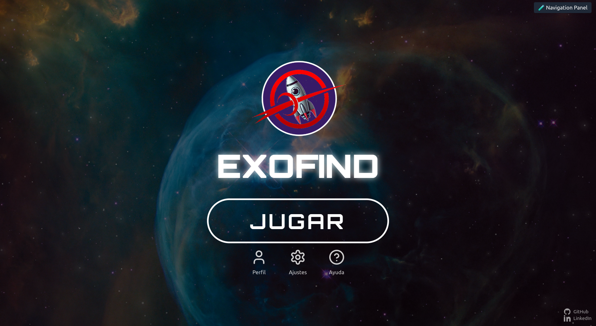
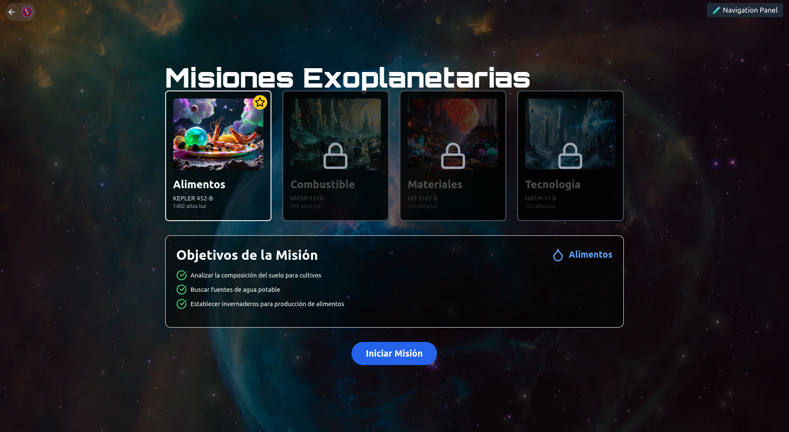

# ExoFind - SpaceApps Challenge

## What is this?

This project is a prototype created in just 2 days during the NASA Space Apps Challenge Hackathon. It was developed by Robotic Intelligence students in Castellón (UJI Robotics Team) as a response to NASA’s educational challenge focused on exoplanets. Its goal is to inspire children to become interested in space and exoplanets through an interactive and entertaining experience.

>Although we implemented many features during the hackathon, this project is closer to an interactive idea than a final product. After the event it has been slightly improved so it can be tested better, but it is still a concept in development.

## Prototype

[www.exofind.netlify.app](https://exofind.netlify.app/)

## Our mission

Many children today dream of being streamers or influencers. With this project we want to change that. We want them to dream of the stars again.

ExoFind seeks to spark curiosity about space exploration in younger audiences, leveraging the tools they already use daily, whether tablets or smartphones. Instead of pulling them away from screens, we use them as a gateway to astronomy.

## Technologies used

- **React**: User interface  
- **Three.js** (React Three Fiber): 3D visualization  
- **Framer Motion**: Animations  
- **Tailwind CSS**: Fast and flexible styling  
- **Netlify**: Free hosting  

## What does the game include?

### Main Screen

This is the entry point to the *EXOFIND* universe. The design is inspired by an immersive space aesthetic, with a nebula background that reinforces the theme of intergalactic exploration. At the center stands the game’s logo: a stylized rocket surrounded by red rings, symbolizing movement, trajectory, and adventure.

The **PLAY** button is direct access to the core of the experience. Just below are three quick accesses:

- **Profile:** where the player can manage their information and progress.  
- **Settings:** to customize the experience (audio, controls, language, etc.).  
- **Help:** with basic information about gameplay, controls, and objectives.  



### Mission Selection

An astronaut has accidentally activated hyperspace and is trapped light-years from Earth. Your mission is to help her return by exploring exoplanets and collecting resources to repair her ship.

Each planet represents a mission with different objectives. All are based on real NASA data:

-  **KEPLER 452-B** (Terrestrial): Search for food and water.  
-  **WASP-121b** (Gas giant): Collect fuel.  
-  **HD 3167 b** (Super-Earth): Extract materials.  
-  **HAT-P-11 b** (Neptunian): Investigate advanced technology.  

Each planet has its own minigame mechanic, based on a real method of exoplanet detection, and an educational card with visual data.



### Exploration

This is the central idea of the game: control a rocket through different scenarios, dodging obstacles and collecting resources while moving forward. The objective is to maintain a balance between exploration and survival, since each collected resource helps extend the journey, but each crash or mistake can be fatal.


### Minigames

Each planet has its own educational minigame, designed to represent interactively a real method of exoplanet detection. These games not only entertain, but also teach players how astronomers discover planets beyond our solar system.

Some of the initial ideas are:

- **Transit (KEPLER 452-B)**  
  Simulates the transit method: the player must detect a planet passing in front of its star by clicking at the exact moment the light dims. If you succeed, you gain points. If you fail or take too long, you lose lives. The difficulty increases with each success.

- **Direct Imaging (HD 3167 b)**  
  A visual puzzle based on real observations of exoplanets through direct imaging. The pieces are scrambled and you must solve it with the fewest moves possible.

- **Radial Velocity (WASP-121b)**  
  Represents the radial velocity method through an animated 3D scene where stars and planets orbit. The player observes how gravity alters the light and must identify patterns. It is currently more visual than interactive, but is intended as a base for future challenges.

### User Profile

Your progress is recorded. From this section you can:

- See your **level**, experience, and completed missions  
- Check **achievements** earned  
- Review discovered exoplanets  
- Explore **skills** developed (science, strategy, exploration)  
- Complete **daily challenges** to keep learning  

Additionally, you can review each discovered planet, read unique descriptions, and learn curiosities.


### Settings Tab

The settings tab allows you to customize the user experience. From here you can:

- Change the interface language.  
- Adjust the overall volume and enable/disable notifications.  
- Configure video resolution and colorblind mode.  
- Customize the highlight color and activate high contrast.  
- Select categories for searches and manage privacy options such as mission history and automatic login.  

>Not all of these settings are currently functional; they are simply a conceptual idea to illustrate the project’s potential.


## Adaptive AI

One of the main ideas of the project was that ExoFind would not teach the same thing to everyone, but would learn with you. 

A machine learning model would adapt to the user’s level of knowledge, increasing or reducing the difficulty of questions and minigames depending on the player.

## Local Installation

1. **Clone the repository:**

```bash
git clone https://github.com/diegomarzaa/ExoFind-space-apps-challenge.git
cd ExoFind-space-apps-challenge
```

2. **Install dependencies:**

```bash
npm install
```

3. **Run in development mode:**

```bash
npm start
```

Open [http://localhost:3000](http://localhost:3000)

## Project Structure

```
├── public/              # HTML, manifest, meta
├── src/
│   ├── components/      # Screens, minigames and navigation
│   ├── img/             # Images
│   ├── App.js           # Main routing
│   └── index.js         # React entry
├── package.json         # Dependencies and scripts
└── tailwind.config.js   # Styles
```

## Collaboration

New ideas? Bugs found? You’re invited to contribute!

- Open an issue with your suggestion or bug  
- Fork it and send a PR
